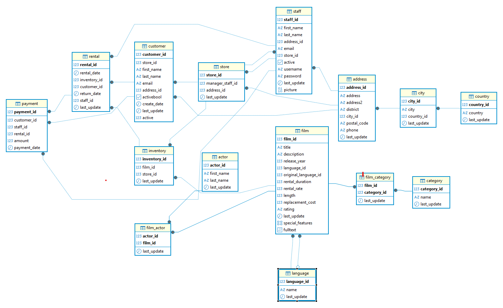

1. Crea el esquema de la BBDD.

2. Muestra los nombres de todas las películas con una clasificación por edades de ‘Rʼ.
	select f.title as Titulo
	from film f 
	where f.rating = 'R';	
3. Encuentra los nombres de los actores que tengan un “actor_idˮ entre 30 y 40.
	select concat(a.first_name ,' ' ,a.last_name ) as NombreActor
	from actor a 
	where a.actor_id between 30 and 40 ;
	//a.actor_id >29 and a.actor_id <41
4. Obtén las películas cuyo idioma coincide con el idioma original.
	select *
	from film f 
	where f.language_id = f.original_language_id ;
	//Quiero comprobar si hay algun registro que no sea nulo
	select Count(f.original_language_id )
	from  film f ;
5. Ordena las películas por duración de forma ascendente.
	select f.title as Titulo, f.length as duracion
	from film f 
	order by f.length asc ;
6 Encuentra el nombre y apellido de los actores que tengan ‘Allenʼ en su apellido.
	select concat(a.first_name ,' ', a.last_name ) as NombreActor
	from actor a 
	where a.last_name like '%ALLEN%';
7. Encuentra la cantidad total de películas en cada clasificación de la tabla “filmˮ y muestra la clasificación junto con el recuento.
	select count(f.film_id ), f.rating 
	from  film f 
	group by f.rating ;
8. Encuentra el título de todas las películas que son ‘PG-13ʼ o tienen una duración mayor a 3 horas en la tabla film.
	select *
	from  film f 
	where f.rating ='PG-13' and f.length >180;
9. Encuentra la variabilidad de lo que costaría reemplazar las películas.
	select Round(variance(f.replacement_cost ),2) as Varianza
	from  film f ;
10 Encuentra la mayor y menor duración de una película de nuestra BBDD.
select 
	MAX(f.length ),
	Min(f.length )
from  film f ;
11. Encuentra lo que costó el antepenúltimo alquiler ordenado por día.
	select *
	from payment 
	where rental_id  IN ( #Obtenemos el rental ID del antepenultumo
		select rental_id 
		from rental  
		order by rental_date desc #El orden es descendente, si fuera al contrario cambiar desc por asc
		limit 1 offset 3);
12. Encuentra el título de las películas en la tabla “filmˮ que no sean ni ‘NC17ʼ ni ‘Gʼ en cuanto a su clasificación.
	select * 
	from film f 
	where f.rating not in ('NC-17', 'G');	
13. Encuentra el promedio de duración de las películas para cada clasificación de la tabla film y muestra la clasificación junto con el promedio de duración.
	select Round(AVG(f.length),2) as "duracion" , f.rating  as "Clasificacion"
	from film f 
	Group by f.rating ;
14. Encuentra el título de todas las películas que tengan una duración mayor a 180 minutos.
	select f.title  as "TituloMas180"
	from film f 
	where f.length >180;
15. ¿Cuánto dinero ha generado en total la empresa?
select SUM(p.amount ) as "Cantidad"
from payment p ;

16. Muestra los 10 clientes con mayor valor de id.
	select *
	from customer c 
	order by c.customer_id desc 
	limit 10;

17.  Encuentra el nombre y apellido de los actores que aparecen en la película con título ‘Egg Igbyʼ
	select concat(a.first_name  ,' ', a.last_name ) as NombreActor 
	from actor a
	join film_actor fa ON a.actor_id = fa.actor_id
	join film f ON fa.film_id = f.film_id
	where  f.title LIKE '%EGG IGBY%';
18. Selecciona todos los nombres de las películas únicos.

19. Encuentra el título de las películas que son comedias y tienen una duración mayor a 180 minutos en la tabla “filmˮ.
	select * from film f where f.film_id  IN(
	select fc.film_id  from film_category fc where fc.category_id IN
	(select  c.category_id from  category c where name like 'Comedy'))
	and f.length >180;
20. Encuentra las categorías de películas que tienen un promedio de duración superior a 110 minutos y muestra el nombre de la categoría junto con el promedio de duración.
select 
    c.name as nombre_categoria, 
    round(avg(f.length),2) as promedio_duracion
from category c
join film_category fc on c.category_id = fc.category_id
join film f on fc.film_id = f.film_id
group by 
    c.name
having 
    avg(f.length) > 110;
21. ¿Cuál es la media de duración del alquiler de las películas?
select round(avg(rental_duration),2) as media_dias_permitidos
from film;
22. Crea una columna con el nombre y apellidos de todos los actores y actrices.
select concat(a.first_name ,' ' ,a.last_name ) as NobreCompleto
from actor a ;
23. Números de alquiler por día, ordenados por cantidad de alquiler de forma descendente.
select 
    date(r.rental_date) as fecha, 
    count(r.rental_id ) as total_alquileres
from rental r
group by 
    fecha
order by 
    total_alquileres desc;

24. Encuentra las películas con una duración superior al promedio.
	select f.title as Titulo,
		f.length as Duracion
from film f 
where f.length > (select avg(f2.length ) from film f2);
25. Averigua el número de alquileres registrados por mes.
select extract(month from r.rental_date) as mes,
count(r.rental_id )
from  rental r 
group by mes ;

26. Encuentra el promedio, la desviación estándar y varianza del total pagado.
select 
    round(avg(p.amount), 2) as promedio,
    round(stddev(p.amount), 2) as desviacion_estandar,
    round(variance(p.amount), 2) as varianza
from payment p;
27. ¿Qué películas se alquilan por encima del precio medio?
select 
    f.title as Titulo, 
    f.rental_rate as Tarifa
from film f 
where rental_rate > (
    select avg(f2.rental_rate) 
    from film f2);
28. Muestra el id de los actores que hayan participado en más de 40 películas.
select 
    fa.actor_id as id_actor, 
    count(fa.film_id) as total_peliculas
from film_actor fa
group by 
    fa.actor_id
having 
    count(fa.film_id) > 40;
29. Obtener todas las películas y, si están disponibles en el inventario, mostrar la cantidad disponible.
select 
    f.title as Titulo, 
    count(i.inventory_id) as cantidad_disponible
from film f
left join inventory i on f.film_id = i.film_id
group by 
    f.film_id, f.title;
30. Obtener los actores y el número de películas en las que ha actuado.
select 
    concat( a.first_name, ' '  , a.last_name) as Nombre_actor,
    count(fa.film_id) as total_peliculas
from actor a
left join film_actor fa on a.actor_id = fa.actor_id
group by 
    Nombre_actor;
31. Obtener todas las películas y mostrar los actores que han actuado en ellas, incluso si algunas películas no tienen actores asociados.
select  
    f.title as titulo_pelicula, 
    concat(a.first_name, ' ', a.last_name) as Nombre_actor   
from film f
left join film_actor fa on f.film_id = fa.film_id
left join actor a on fa.actor_id = a.actor_id;
32. Obtener todos los actores y mostrar las películas en las que han actuado, incluso si algunos actores no han actuado en ninguna película.
select concat( a.first_name,' ' ,a.last_name) as Nombre_actor, f.title as titulo
from actor a
left join film_actor fa on a.actor_id = fa.actor_id
left join film f on fa.film_id = f.film_id;
33. Obtener todas las películas que tenemos y todos los registros de alquiler.
select f.title, r.rental_id, r.rental_date
from film f
left join inventory i on f.film_id = i.film_id
left join rental r on i.inventory_id = r.inventory_id;
34. Encuentra los 5 clientes que más dinero se hayan gastado con nosotros.
select 	concat(c.first_name, ' ' ,c.last_name), 
		sum(p.amount) as total_gastado
from customer c
join payment p on c.customer_id = p.customer_id
group by c.customer_id, c.first_name, c.last_name
order by total_gastado desc
limit 5;
35. Selecciona todos los actores cuyo primer nombre es 'Johnny'.
select * from acto ar where first_name = 'johnny';
36. Renombra la columna “first_nameˮ como Nombre y “last_nameˮ como Apellido. 
Aqui se haria con un as pero no se dice de que tabla
37. Encuentra el ID del actor más bajo y más alto en la tabla actor.
select min(a.actor_id), max(a.actor_id) from actor a;
38. Cuenta cuántos actores hay en la tabla “actorˮ.
select count(*) from actor a;
39. Selecciona todos los actores y ordénalos por apellido en orden ascendente.
select * from actor order by last_name asc;
40. Selecciona las primeras 5 películas de la tabla “filmˮ.
select * from film limit 5;
41. Agrupa los actores por su nombre y cuenta cuántos actores tienen el mismo nombre. ¿Cuál es el nombre más repetido?
select a.first_name, count(a.actor_id ) as num_veces
from actor a
group by a.first_name
order by num_veces desc;
42. Encuentra todos los alquileres y los nombres de los clientes que los realizaron.
select r.rental_id , concat(c.first_name, ' ' ,c.last_name) as Nombre_cliente
from rental r
join customer c on r.customer_id = c.customer_id;
43. Muestra todos los clientes y sus alquileres si existen, incluyendo aquellos que no tienen alquileres.
select  r.rental_id, concat(c.first_name, ' ' ,c.last_name) as Nombre_cliente
from customer c
left join rental r on c.customer_id = r.customer_id;
44. Realiza un CROSS JOIN entre las tablas film y category. ¿Aporta valor esta consulta? ¿Por qué? Deja después de la consulta la contestación.
select f.title, c.name
from film f
cross join category c;
No tiene ningun sentido, para una misma pelicula me cruza con todas las categorias
45. Encuentra los actores que han participado en películas de la categoría 'Action'.
select * from actor a where a.actor_id  in (
select fa.actor_id  from 	film_actor fa  where fa.film_id in 
(select  fc.film_id  from film_category fc where fc.category_id in(
select c.category_id  from category c where c.name = 'Action')));
46. Encuentra todos los actores que no han participado en películas.
select a.*
from actor a
left join film_actor fa on a.actor_id = fa.actor_id
where fa.film_id is null;
47. Selecciona el nombre de los actores y la cantidad de películas en las que han participado.
select concat(a.first_name,' ' ,a.last_name) as Nombre_actor, 
	count(fa.film_id) as num_peliculas
from actor a
join film_actor fa on a.actor_id = fa.actor_id
group by a.actor_id, a.first_name, a.last_name
order by num_peliculas desc;
48. Crea una vista llamada “actor_num_peliculasˮ que muestre los nombres de los actores y el número de películas en las que han participado.
create view actor_num_peliculas as
select a.first_name, a.last_name, count(fa.film_id) as num_peliculas
from actor a
join film_actor fa on a.actor_id = fa.actor_id
group by a.actor_id, a.first_name, a.last_name;
49. Calcula el número total de alquileres realizados por cada cliente.
	select	count(r.inventory_id ) as total_rentas,
		Concat(c.first_name , ' ' ,c.last_name ) as Nombre_cliente	
	from rental r
	join customer c  on r.customer_id =c.customer_id 
	group by Nombre_cliente;
50. Calcula la duración total de las películas en la categoría 'Action'.
select Sum(f.length ) 
from film f 
where f.film_id  in (
		select fc.film_id  from film_category fc 
		where fc.category_id In(
			select c.category_id  from category c where c.name = 'Action'));
51. Crea una tabla temporal llamada “cliente_rentas_temporalˮ para almacenar el total de alquileres por cliente.
create temporary table cliente_rentas_temporal as
select customer_id, count(*) as total_alquileres
from rental
group by customer_id;
52. Crea una tabla temporal llamada “peliculas_alquiladasˮ que almacene las películas que han sido alquiladas al menos 10 veces.
create temporary table peliculas_alquiladas as
select i.film_id, f.title, count(r.rental_id) as veces_alquilada
from rental r
join inventory i on r.inventory_id = i.inventory_id
join film f on i.film_id = f.film_id
group by i.film_id, f.title
having count(r.rental_id) >= 10;
53. Encuentra el título de las películas que han sido alquiladas por el cliente con el nombre ‘Tammy Sandersʼ y que aún no se han devuelto. Ordena los resultados alfabéticamente por título de película.
select f.title
from customer c
join rental r on c.customer_id = r.customer_id
join inventory i on r.inventory_id = i.inventory_id
join film f on i.film_id = f.film_id
where c.first_name = 'Tammy' and c.last_name = 'Sanders'
and r.return_date is null
order by f.title asc;

select * from actor a where a.first_name = 'Tammy';
No hay ningun actor con Tammy
54. Encuentra los nombres de los actores que han actuado en al menos una película que pertenece a la categoría ‘Sci-Fiʼ. Ordena los resultados alfabéticamente por apellido.
select distinct a.first_name, a.last_name
from actor a
join film_actor fa on a.actor_id = fa.actor_id
join film_category fc on fa.film_id = fc.film_id
join category c on fc.category_id = c.category_id
where c.name = 'Sci-Fi'
order by a.last_name asc;
55. Encuentra el nombre y apellido de los actores que han actuado en películas que se alquilaron después de que la película ‘Spartacus Cheaperʼ se alquilara por primera vez. Ordena los resultados alfabéticamente por apellido.
select distinct a.first_name, a.last_name
from actor a
join film_actor fa on a.actor_id = fa.actor_id
join inventory i on fa.film_id = i.film_id
join rental r on i.inventory_id = r.inventory_id
where r.rental_date > (
    select min(r2.rental_date)
    from rental r2
    join inventory i2 on r2.inventory_id = i2.inventory_id
    join film f2 on i2.film_id = f2.film_id
    where LOWER(f2.title) = 'spartacus cheaper'
)
order by a.last_name asc;
Uso la function lower por que todas las peliculas estan en mayusculas

56. Encuentra el nombre y apellido de los actores que no han actuado en ninguna película de la categoría ‘Musicʼ.
select first_name, last_name
from actor
where actor_id not in (
    select fa.actor_id
    from film_actor fa
    join film_category fc on fa.film_id = fc.film_id
    join category c on fc.category_id = c.category_id
    where c.name = 'music'
);
57. Encuentra el título de todas las películas que fueron alquiladas por más de 8 días.
select distinct f.title
from film f
join inventory i on f.film_id = i.film_id
join rental r on i.inventory_id = r.inventory_id
where extract(day from (r.return_date - r.rental_date)) > 8;
58. Encuentra el título de todas las películas que son de la misma categoría que ‘Animationʼ.
select f.title
from film f
join film_category fc on f.film_id = fc.film_id
where fc.category_id = (select category_id from category where name = 'Animation');
59. Encuentra los nombres de las películas que tienen la misma duración que la película con el título ‘Dancing Feverʼ. Ordena los resultados alfabéticamente por título de película.
select title
from film
where length = (select length from film where lower(title) = 'dancing fever')
order by title asc;
60. Encuentra los nombres de los clientes que han alquilado al menos 7 películas distintas. Ordena los resultados alfabéticamente por apellido.
select c.first_name, c.last_name
from customer c
join rental r on c.customer_id = r.customer_id
join inventory i on r.inventory_id = i.inventory_id
group by c.customer_id, c.first_name, c.last_name
having count(distinct i.film_id) >= 7
order by c.last_name asc;
61. Encuentra la cantidad total de películas alquiladas por categoría y muestra el nombre de la categoría junto con el recuento de alquileres.
select c.name, count(r.rental_id) as total_alquileres
from category c
join film_category fc on c.category_id = fc.category_id
join inventory i on fc.film_id = i.film_id
join rental r on i.inventory_id = r.inventory_id
group by c.name;
62. Encuentra el número de películas por categoría estrenadas en 2006.
select c.name, count(f.film_id)
from category c
join film_category fc on c.category_id = fc.category_id
join film f on fc.film_id = f.film_id
where f.release_year = 2006
group by c.name;
63. Encuentra la cantidad total de películas alquiladas por cada cliente y muestra el ID del cliente, su nombre y apellido junto con la cantidad de películas alquiladas.
select c.customer_id, c.first_name, c.last_name, count(r.rental_id) as total_alquilado
from customer c
join rental r on c.customer_id = r.customer_id
group by c.customer_id, c.first_name, c.last_name;
64. Obtén todas las combinaciones posibles de trabajadores con las tiendas que tenemos.
select s.first_name, s.last_name, st.store_id
from staff s
cross join store st;